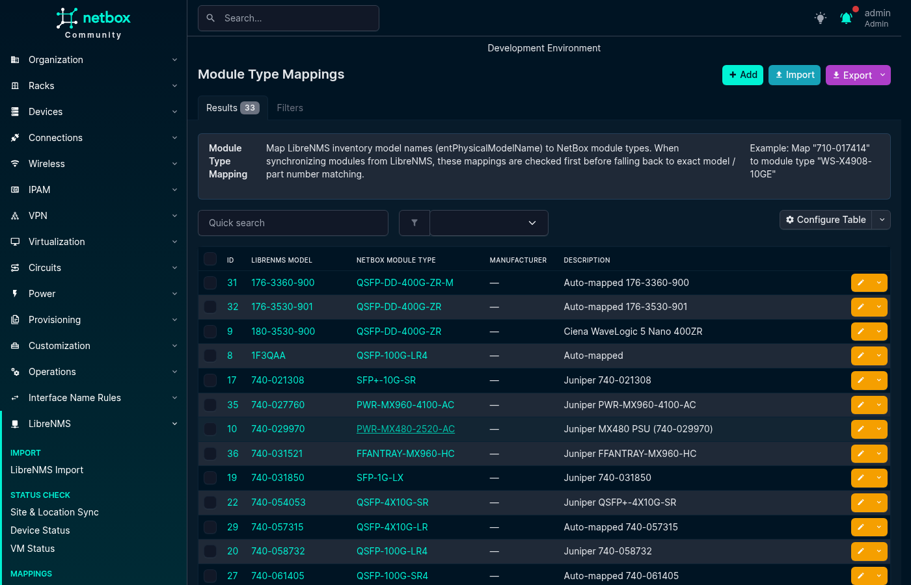
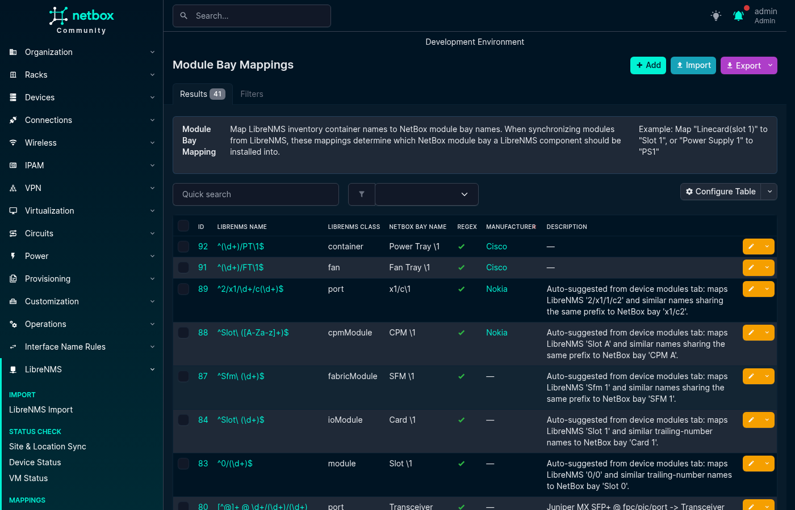

# Mappings

Mappings translate values reported by LibreNMS into the corresponding NetBox object or choice. They are useful when the two systems use different names for the same platform, hardware, location, module, bay, or interface type.

Open **LibreNMS → Mappings** and use the tabs at the top of the page to switch between mapping types. Each tab supports creating, editing, deleting, filtering, bulk importing, and exporting mappings.

## Interface Type Mappings

Interface Type Mappings are interface rules. A rule selects LibreNMS ports, then sets a NetBox interface type for them or ignores them. Open them at **LibreNMS → Mappings → Interface Mappings**.

### Fields

| Field | Meaning |
|---|---|
| `action` | `set_type` (the default) gives matching ports a NetBox type. `ignore` keeps matching ports out of the sync. |
| `platform` | The NetBox platform of the object that owns the interface: the device, the virtual chassis member, or the virtual machine. Blank means every platform. In an import, use the platform slug. |
| `name_pattern` | A Python regular expression. It is searched in `ifName` and in `ifDescr`, and a match in either counts. It is case-sensitive; use `(?i)` to ignore case. Blank means any name. |
| `librenms_type` | The LibreNMS `ifType`, matched exactly and case-sensitive, for example `ethernetCsmacd`. Blank means any type. |
| `librenms_speed` | The minimum port speed in Kbps. It needs a `librenms_type`. An Ignore rule has no speed. |
| `netbox_type` | The NetBox interface type a Set type rule writes. An Ignore rule has none. |

A rule needs at least one of `platform`, `name_pattern` and `librenms_type`. All selectors of a rule must match. Two rules cannot have the same `platform`, `name_pattern`, `librenms_type` and `librenms_speed`, whatever their action.

LibreNMS reports speed in bits per second. The plugin converts it to Kbps before it compares it with `librenms_speed`.

### Which rule applies

1. An Ignore rule that matches always wins.
2. Otherwise the most specific Set type rule wins. A rule with a platform comes first, then a rule with a name pattern, then a rule with a type, then the rule with the highest speed at or below the port speed.
3. Two Set type rules of equal rank make the port ambiguous. The plugin does not create or update the interface, and the Interface Sync table names both rules.
4. When no rule matches, a new interface gets the type **Other**, and an existing interface keeps its type.

The Type column of the Interface Sync table shows :material-link-variant: and the rule when a rule sets the type, and :material-link-variant-off: when no rule does.

Rules with only a type and a speed keep their old result. For example:

```text
ethernetCsmacd + 10000000 -> 10GBASE-T (10GE)
ethernetCsmacd + 1000000  -> 1000BASE-T (1GE)
ethernetCsmacd + no speed -> fallback for other speeds
platform EOS + ^Et        -> wins over all three on an EOS device
```

### What Ignore blocks

An Ignore rule never deletes or changes an object that exists in NetBox. For an ignored port the plugin does not:

- create, update, rebind or link the interface in Interface Sync. The table hides ignored ports; the **N ignored** toggle shows them greyed out, with the rule and no checkbox.
- create the interface from the IP Addresses tab, or assign an address to an interface when the address's port or the port bound to that interface is ignored. This includes a confirmed reassignment and the primary IP. The row shows **Ignored** and the rule.
- create, tag or replace a cable in Cable Sync when the port is at either end of the row, is bound to an endpoint (a remote end you picked too), or is at the far end of a cable the replacement removes. The row shows **Ignored** and the rule, and the whole cable change is skipped.

An ambiguous port blocks only interface writes. It does not block an IP assignment or a cable, because they write no interface type.

Each port is decided with the platform of the NetBox device that owns it. For a cable, the port the neighbour advertised belongs to the neighbour device, also when you pick a remote end on another device. When no NetBox device owns the advertised port (the neighbour is not in NetBox, or its chassis member is not known), the port has no platform, so only rules without a platform can match it. A remote end you pick is checked on its own: the port bound to the picked interface uses the picked device's platform.

A message names the refused port and the rule only when you can view the device that owns the port and the interface bound to it. Otherwise, and when no NetBox device owns the port, the change is still refused, but the message does not name the port or the rule.

The IP and cable checks need the LibreNMS port record. When the record is missing and an Ignore rule could apply to the platform, the row asks you to refresh the data. When no Ignore rule could apply, the change goes ahead.

### Examples

```yaml
# Keep VLAN interfaces of every Arista EOS device out of the sync.
- action: ignore
  platform: arista-eos
  name_pattern: "^Vlan"
  description: "EOS SVIs"

# 10G ports named Te on Cisco IOS devices are SFP+.
- action: set_type
  platform: cisco-ios
  name_pattern: "^Te"
  netbox_type: 10gbase-x-sfpp

# Any Ethernet port at 1 Gbps or more is 1000BASE-T, unless a more specific rule matches.
- librenms_type: ethernetCsmacd
  librenms_speed: 1000000
  netbox_type: 1000base-t

- librenms_type: ieee8023adLag
  netbox_type: lag
  description: "Link aggregation groups"
```

Import rules with a `name_pattern` as YAML or JSON. NetBox's CSV import removes the spaces at the start and end of each cell, so the plugin refuses a CSV import that has a `name_pattern` column. A pattern that does not compile is refused when you save the rule.

## Device Type Mappings

Device Type Mappings translate a LibreNMS hardware string, such as `Juniper MX480 Internet Backbone Router`, into a NetBox Device Type during Device Import.

Matching is case-insensitive and exact. The plugin first compares the hardware string with a Device Type Mapping. If no mapping matches, it compares the value with the NetBox Device Type part number and model. Partial and containment matching are not used.

```yaml
- librenms_hardware: "Juniper MX480 Internet Backbone Router"
  netbox_device_type: MX480
  description: "Juniper MX480"
```


## Module Type Mappings

Module Type Mappings translate a LibreNMS `entPhysicalModelName`, such as `SFP-1G-T`, into a NetBox Module Type during Module Sync.

A mapping can optionally be limited to a manufacturer. When a manufacturer-specific and a global mapping both match the same model string, the manufacturer-specific mapping takes precedence.

```yaml
- librenms_model: SFP-1G-T
  manufacturer: ""
  netbox_module_type: SFP-1G-T
  description: "1G copper SFP"

- librenms_model: 3HE16474AA
  manufacturer: Nokia
  netbox_module_type: 3HE16474AA
  description: "Nokia CPM"
```



## Module Bay Mappings

Module Bay Mappings translate a LibreNMS `entPhysicalName`, such as `Power Supply 1`, into a NetBox module bay name, such as `PSU1`.

Mappings support exact values or Python regular expressions. With a regular expression, the NetBox bay name can use backreferences such as `\1`. An optional LibreNMS class limits the mapping to an ENTITY-MIB class such as `powerSupply`, `fan`, or `module`. Mappings can also be limited to a manufacturer; a manufacturer-specific match takes precedence over a global match.

```yaml
- librenms_name: "Power Supply 1"
  librenms_class: powerSupply
  netbox_bay_name: PSU1
  is_regex: false
  manufacturer: ""
  description: ""

- librenms_name: "^FPC(\\d+)$"
  librenms_class: module
  netbox_bay_name: "FPC\\1"
  is_regex: true
  manufacturer: Juniper
  description: "Map Juniper FPC names"
```



## Platform Mappings

Platform Mappings translate a LibreNMS OS string, such as `junos`, `eos`, or `ios`, into a NetBox Platform. They are used during Device Import and Device Field Sync.

Matching is case-insensitive. The plugin first tries an exact NetBox Platform name. If that does not produce a unique result, it uses a Platform Mapping. If neither method produces a unique result, the platform remains unset.

```yaml
- librenms_os: junos
  netbox_platform: JunOS
  description: "Juniper JunOS"
```


## Location Mappings

Location Mappings translate a value parsed from a LibreNMS location string into a NetBox **Site**, **Location**, **Rack**, or **Tenant** during Device Import. Use a mapping when a parsed value does not exactly match the NetBox object name, for example when LibreNMS reports `NYC` and the NetBox site is named `New York`.

Create the target NetBox object before creating its mapping. Matching is case-insensitive. The plugin first tries an exact NetBox name; for locations, it also checks ancestor names in the matched site's location hierarchy. It then uses a Location Mapping if no exact match is found.

Site and Tenant mappings are global. Location and Rack mappings are scoped to a parent site, so the same LibreNMS value can map to different objects in different sites. During bulk import, include `parent_site` when the target Location or Rack name is not unique across sites.

```yaml
- field_type: site
  librenms_value: NYC
  netbox_object: New York
  description: "LibreNMS NYC to NetBox New York"

- field_type: rack
  librenms_value: R12
  netbox_object: Rack-12
  parent_site: New York
  description: "Rack alias scoped to New York"
```

`netbox_object` and `parent_site` use NetBox object names. The `parent_site` value identifies the target during import; it is not the parsed LibreNMS site token.

The `region` placeholder can be used when [parsing a location string](import_settings.md#location-parsing), but Region is not a Location Mapping type. A device inherits its region from its site.

## Importing and Exporting Mappings

All mapping tabs support NetBox's standard CSV, JSON, and YAML bulk import. Select **Import** on the relevant list and provide records using that mapping type's field names.

To back up or move mappings between NetBox installations, select records in a list and use the YAML export action. Example files for all mapping types are available in the repository's [`contrib/`](../../contrib/) directory.
