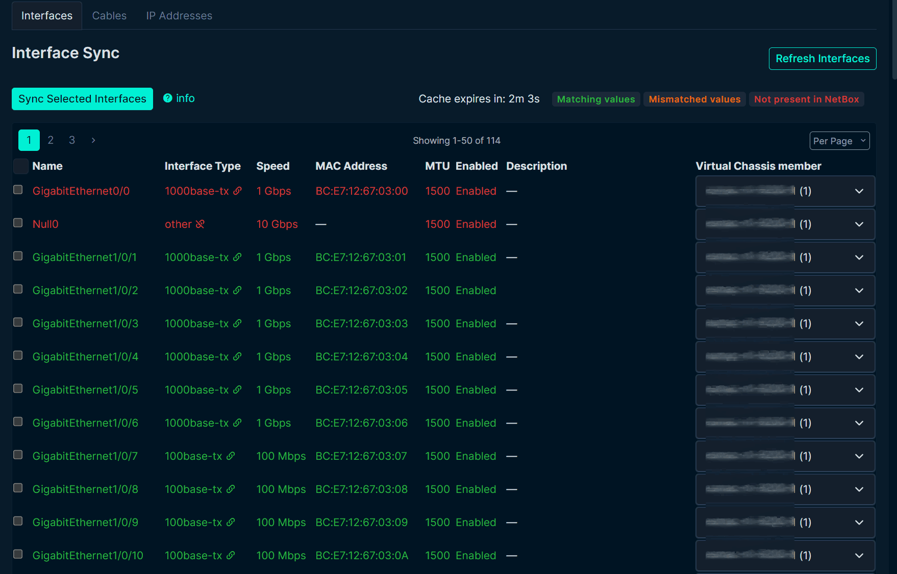

# Virtual Chassis Support

## Overview

The plugin automatically detects Virtual Chassis configurations and displays all VC interfaces on the LibreNMS Sync page of the designated sync device.

**LibreNMS Sync Device Selection Priority:**
1. Member with `librenms_id` custom field (highest priority)
2. Master device with primary IP
3. Any member with primary IP
4. Member with lowest VC position

> **Note:** LibreNMS treats a Virtual Chassis as a single logical device. Only one member (the sync device) should have the `librenms_id` custom field set.

## Stack Detection

On import, the plugin reads the ENTITY-MIB inventory root and its direct children. It detects a stack from one of two shapes:

- **Chassis members:** two or more `chassis` rows directly under the stack (or chassis) root, for example Cisco StackWise. The member whose serial matches the LibreNMS device serial is the master.
- **Junos Virtual Chassis:** one `chassis` root whose description contains "Virtual Chassis", with two or more `container` rows directly under it whose description starts with "FPC". Each FPC must have its own serial, and the root serial must match exactly one FPC, which is the master. The member model is the FPC name (for example `EX4400-24X-S`).

The master is the one member whose serial matches the device serial. Both serials go through the serial normalization rules first: the global rules and the rules of the manufacturer of the DeviceType that the device imports as. That DeviceType comes from a DeviceType mapping or the hardware string, then from the chassis model in the inventory. So a decorated serial such as Juniper's `S/N BCFB9793` still matches. If no member or more than one member matches, the import creates the device without a virtual chassis and shows a warning. The Virtual Chassis details dialog and the import confirmation say so before the import. If the inventory matches neither shape, the device is imported as a single device. The **VC Serials** dialog on the LibreNMS Sync page lists the same members.

## Member Positions

On import, each member gets the position number that the device reports for it. Junos numbers its members from 0 (`ge-0/0/0` is on member 0), so a Junos Virtual Chassis gets positions 0, 1, and so on. Cisco StackWise numbers its members from 1. If any member reports no position, a negative position, or the same position as another member, the plugin numbers all members in inventory order, starting at 1, so that no two members share a position.

## How It Works

### Member Selection

When viewing a device that is part of a virtual chassis, the plugin will:

1. Detects if the device is part of a virtual chassis and displays 'Virtual Chassis Member' column.
2. Automatically select the VC member by matching the device VC position to the first number in the interface name.
3. Allows selection of specific members if the auto select is not correct.

> Selecting a new member will trigger a new interface details comparison against the newly selected NetBox VC member.

Interfaces data is then synced to the selected VC member in Netbox.

#### Virtual Chassis Member Select

